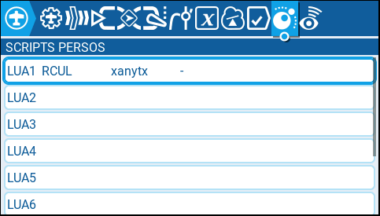
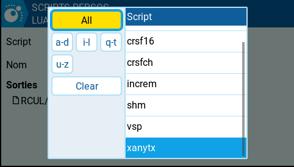
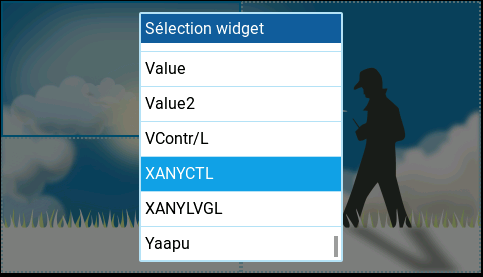
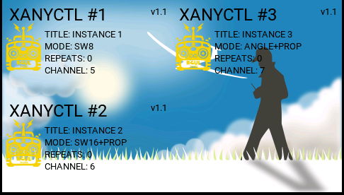
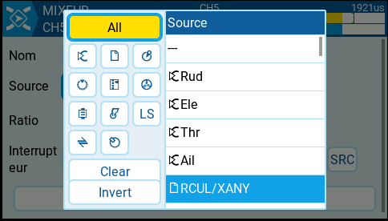
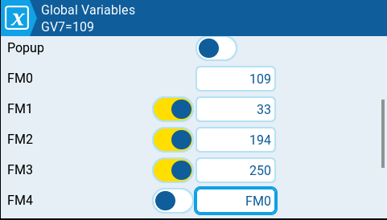
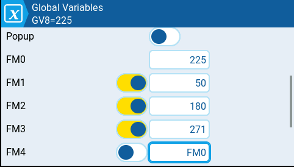
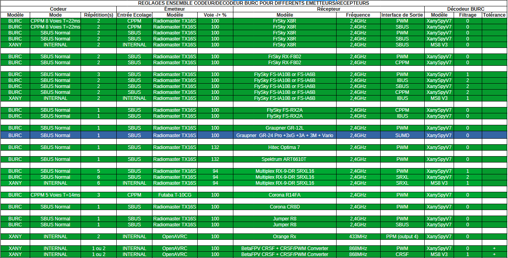

# XANYCTL Widget for EdgeTX (Radiomaster TX16S)
This widget uses the RCUL/XANY protocol created by Rc-Navy.  
The RCUL project of Rc-Navy is described [here](http://p.loussouarn.free.fr/arduino/exemple/BURC/BURC.html)  

Many thanks to him !  

## Overview

**XANYCTL** is a touchscreen widget for **EdgeTX** designed to control a **Multiplex XAny encoder** using Lua.  
It provides a graphical interface (buttons + slider) that allows the pilot to control **up to 16 logical switches** and an optional **PROP analog parameter**.

The widget is intended to work with a companion **Mix script** that converts the widget state into a valid **XAny pulse stream** sent on a radio channel.

Typical use case:

TX16S → EdgeTX widget → Lua Mix script → RC channel → receiver → XAny decoder.

The project is composed of two main parts:

* **Widget UI (WIDGETS/XANYCTL)** – graphical interface and state management
* **Mix script (SCRIPTS/MIXES/xanytx.lua)** – XAny protocol generation


---

# Architecture

```
SDCARD/
 ├─ WIDGETS/
 │   └─ XANYCTL/
 │        ├─ main.lua
 │        ├─ buttons.lua
 │        ├─ TEMPLATE.lua
 │        ├─ README.md
 │        ├─ Languages/
 │        │  └─ cn,de,en,fr,it,sp,ua
 │        └─ Images/
 │            └─ all png files
 └─ SCRIPTS/
     └─ MIXES/
          ├─ xanytx.lua
		  ├─ xanytx_common.lua
		  ├─ xanytx1.lua
		  ├─ xanytx2.lua
		  ├─ xanytx3.lua
		  └─ xanytx4.lua
```


## main.lua

This is the **widget entry point**.

Responsibilities:

- Define **widget options**
- Provide the **API used by the UI**
- Store and retrieve values from **EdgeTX Global Variables (GVARS)**
- Initialize the GUI and load configuration

The widget does **not generate XAny frames directly**.  
It only stores user inputs in GVars which are later read by the mix script.


## buttons.lua

Contains the **graphical interface** using **libGUI**.

Features:

- Toggle buttons
- Momentary buttons
- Vertical PROP slider
- Rounded UI elements
- Optional shadows
- Custom ON/OFF colors
- Touch interaction

The UI is intentionally separated from `main.lua` to keep the architecture modular.


## xanytx.lua

Lua **Mix Script** responsible for generating the XAny signal.

Responsibilities:

- Read widget state from **GVars**
- Build the **XAny payload**
- Compute checksum
- Apply **R compression**
- Handle **Repeat**
- Convert nibbles to **EdgeTX pulse widths**
- Output signal on the assigned RC channel


---

# Data Storage (GVars)

The widget uses **EdgeTX Global Variables** to exchange data with the mix script.

| GVar | Purpose |
|-----|--------|
| GV1 | Switch mask (low bits) |
| GV2 | Switch mask (high bits) |
| GV3 | Repeat value |
| GV4 | Mode |
| GV5 | Channel memory |
| GV6 | Motors Synchro |
| GV7 | PROP value (0-255) |
| GV8 | ANGLE value (0-360°) |

# Supported Modes

| Mode | Description |
|-----|-------------|
| 0 | SW8 |
| 1 | SW8 + PROP |
| 2 | SW16 |
| 3 | SW16 + PROP |
| 4 | ANGLE + PROP |


---

# User Interface

The UI uses **libGUI** components:

- Rounded buttons
- Toggle and momentary actions
- Vertical slider
- Customizable colors
- Optional shadows
- Optional Motors Synchro
- Optional languages

The slider controls the **PROP value (0-255)** and displays the percentage.

---

# Installation

## 1. Copy Files
1. Copy the WIDGETS/XANYCTL/ folder to the SD card: 
   /WIDGETS/XANYCTL/main.luac  
   /WIDGETS/XANYCTL/buttons.luac  
   /WIDGETS/XANYCTL/TEMPLATE.lua  
   
2. Copy the SCRIPTS/TOOLS/ folder to the SD card: 
   SCRIPTS/TOOLS/xanytx_common.luac  
   SCRIPTS/TOOLS/xanytx.lua  
   SCRIPTS/TOOLS/xanytx1.lua  
   SCRIPTS/TOOLS/xanytx2.lua  
   SCRIPTS/TOOLS/xanytx3.lua  
   SCRIPTS/TOOLS/xanytx4.lua  

3. Verify that LibGUI is present:  
   /WIDGETS/LibGUI/libgui.lua  (ou libgui.luac)  

4. On first startup, a file <ModelName>.lua is created:  
   Exemple : MODEL011 :  
   /WIDGETS/XANYCTL/MODEL011.lua  
   You can edit the labels for buttons and sliders.  
   Each button can be set to **toggle** or **momentary**.  
   You can also edit the title name for each widget.  

## 2. Add the widget to your model
1. Open the **MODEL** page.  
2. Open **SRIPTS PERSOS** tab.  
  
3. Open first free LUAx, edit it and select **xanytx** as script.  
You can also define a name for each widget (**RCUL** by example).  
  
4. Define a new screen for your widget, and select a full-page screen or one split into two or four parts.  
5. Select an empty slot and choose the widget **XANYCTL**.  
  
Up to 4 widgets can be used.  
Each widget will be defined by its **#ID** number and its **CH** (channel) on which it will operate.  
example with 3 instances:  
  
6. Open the Mixer tab and add the channel (**CH**) used by the widget.  
You will notice that the channel is moving rapidly. This is normal.  
**In the OUTPUTS tab, absolutely keep the +-100% and never reverse the channel**.  


**Very important, if you are using azimuth motors**
We must separate the Flight Modes (FM) in GV7 (PROP) and GV8 (ANGLE) for a simple reason:
👉 Each pod must have its own independent values.  
  
  

If all FM share the same GVars:
Changing the slider on pod 1 also changes pods 2, 3, and 4.  
This creates a false permanent sync.  

Separating by FM:  
FM0 → pod 1  
FM1 → pod 2  
FM2 → pod 3  
FM3 → pod 4  

👉 Each pod retains its own value.  
👉 Synchronization becomes voluntary (via the mask), and not involuntary.  

In summary:  
Without FM separation → everything moves together  
With separation → independent control + controlled synchronization 👍  

## 3. Configure Options

Available widget's options:

* ID
* MODE
* CH
* Repeat
* OffCol (color Off mode)  
* OnCol (color On mode)  
* Shadow  
* Synchro
* Language

---

## 4. Several sesults
Screen height buttons  


Screen height buttons and one slider  


Screen sixteen buttons  


Screen sixteen buttons and one slider   


Screen Angle and Slider for azimuthal  


# Change labels
You can to adapt labels of 4 instances.  
When the widget is first launched, a Lua file named with the model name, TOTO.lua, is created in the widget folder. 
This file defines the labels for each button or slider, as well as the button type (permanent or momentary).  

```
  [1] = {
    title = "INSTANCE 1",
    buttons = {
      { label="Feux Mât",  type="toggle",    logo="mat.png" },
      { label="Radar",  type="toggle",    logo="radar.png" },
      { label="Klaxon",  type="momentary",    logo="klaxon.png" },
      { label="Sound 1",  type="momentary",    logo="sound.png" },
      { label="Sound 2",  type="momentary",    logo="sound.png" },
      { label="Sound 3",  type="momentary",    logo="sound.png" },
      { label="Sound 4",  type="momentary",    logo="sound.png" },
      { label="Sound 5",  type="momentary",    logo="sound.png" },
      { label="9",  type="toggle",    logo="" },
      { label="10", type="toggle",    logo="" },
      { label="11", type="toggle",    logo="" },
      { label="12", type="toggle",    logo="" },
      { label="13", type="toggle",    logo="" },
      { label="14", type="toggle",    logo="" },
      { label="15", type="toggle",    logo="" },
      { label="16", type="toggle",    logo="" },
    },
    prop = { label = "VOLUME", logo="sound.png" },
  },
```

# Hardware Tested

- Radiomaster **TX16S**
- EdgeTX **2.11.x**
- Multiplex **XAny**
- Custom Arduino **Xany2Spy decoder**

---

# Compatibilities

## Which receivers are usable
In theory, this widget is compatible with a multitude of receivers.  
The most suitable are the **Frsky X8R** receivers, for example.  
Receivers tested:  
1. **2.4gHz**  
  FrSky X8R  
  FrSky RX-F802  
  FlySky FS-IA10B  
  Flysky FS-IA6B  
  FlySky FS-RX2A  
  Graupner GR-12L  
  Graupner  GR-24 Pro +3xG +3A + 3M + Vario  
  Hitec Optima 7  
  Spektrum ART6610T  
  Multiplex RX-9-DR SRXL16 (bad compatibility)  
  Corona R14FA  
  Corona CR8D  
  Jumper R8  
2. **868Mhz**  
  Orange Rx  
  BetaFPV CRSF + CRSF/PWM Converter  
  
3. Full configuration details according to the receivers  
    

## Which Xany/RCUL compatibles projects can be used
1. MultiSwitch_Sw16-ProMicro
   * [V1.0](https://github.com/Ingwie/OpenAVRc_Hw/tree/V3/MultiSwitch_Sw16-ProMicro)  
     
   
1. MultiSwitch_Sw8 (deprecated)
   * [V1.0](https://github.com/Ingwie/OpenAVRc_Hw/tree/V3/MultiSwitch_Sw8)  
     
   
1. MultiSwitch_Sw8 V2
   * [V1.2](https://github.com/Ingwie/OpenAVRc_Hw/tree/V3/MutltiSwitch_Sw8_V2)  
     
   
1. MultiSwitch_Sw8 V3
   * [V1.3](https://github.com/Ingwie/OpenAVRc_Hw/tree/V3/MultiSwitch_Sw8_V3)  
     
   
1. The MS8-Xany card used as an Impulse Sequencer
   * [V1.0](https://github.com/Ingwie/OpenAVRc_Hw/tree/V3/MultiSwitch_Sw8_PulseSeq)  
     
   
1. Xany2Msx
   * [V1.0](https://github.com/Ingwie/OpenAVRc_Hw/tree/V3/Xany2Msx)  
     

1. Capteur_Hall_I2C
   * [V1.0](https://github.com/Ingwie/OpenAVRc_Hw/tree/V3/Capteur_Hall_I2C)  
     
   
1. Capteur_Hall_I2C Mini
   * [V1.0](https://github.com/Ingwie/OpenAVRc_Hw/tree/V3/Capteur_Hall_I2C_Mini)  
     
   
1. Encoder A1335 I2C
   * [V1.0](https://github.com/Ingwie/OpenAVRc_Hw/tree/V3/PCB%20A1335_Encoder)  
     

   
1. Xany2Sounds
   * [V1.0](https://github.com/Ingwie/OpenAVRc_Hw/tree/V3/Xany2Sounds)  
     
   
1. Sound&SmokeModule
   * [V1.1](https://github.com/Ingwie/OpenAVRc_Hw/tree/V3/Sound&SmokeModule)  
        
	  
1. Futaba FP-S148/S3003 replacement
   * [V1.0](https://github.com/Ingwie/OpenAVRc_Hw/tree/V3/LUCAS_FPS148_FS3003)  
     

# Future Work

Planned improvements:

- Multi instances support (up to 4 widgets)
- Improved layout system
- Advanced slider styling
- Optional telemetry feedback


---

# Author

Original concept and testing by the project author.  
Development assistance provided via AI collaboration.

