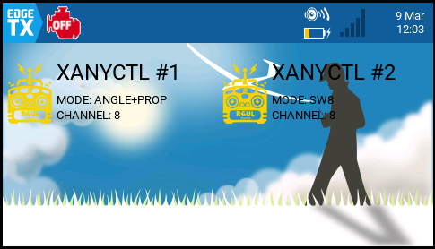
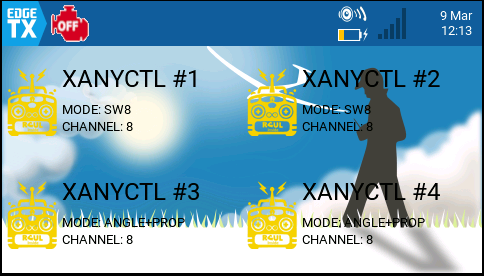
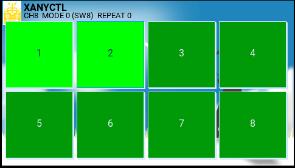
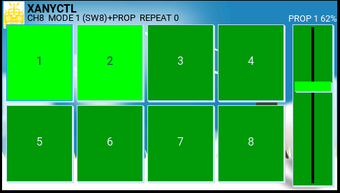
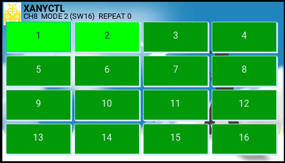
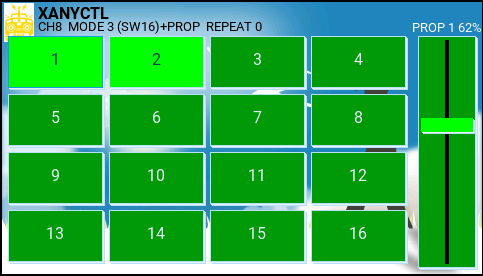
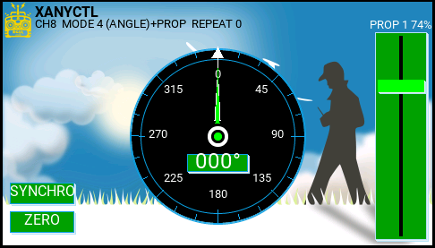

# XANYCTL Widget for EdgeTX (Radiomaster TX16S)
This widget uses the RCUL/XANY protocol created by Rc-Navy.  
The RCUL project of Rc-Navy is described [here](http://p.loussouarn.free.fr/arduino/exemple/BURC/BURC.html)  

Many thanks to him !  

## Overview

**XANYCTL** is a touchscreen widget for **EdgeTX** designed to control a **Multiplex XAny encoder** using Lua.  
It provides a graphical interface (buttons + slider) that allows the pilot to control **up to 16 logical switches** and an optional **PROP analog parameter**.

The widget is intended to work with a companion **Mix script** that converts the widget state into a valid **XAny pulse stream** sent on a radio channel.

Typical use case:

TX16S → EdgeTX widget → Lua Mix script → RC channel → receiver → XAny decoder.

The project is composed of two main parts:

* **Widget UI (WIDGETS/XANYCTL)** – graphical interface and state management
* **Mix script (SCRIPTS/MIXES/xanytx.lua)** – XAny protocol generation


---

# Architecture

```
SDCARD/
 ├─ WIDGETS/
 │   └─ XANYCTL/
 │        ├─ main.lua
 │        ├─ buttons.lua
 │        ├─ TEMPLATE.lua
 │        ├─ README.md
 │        ├─ Languages/
 │        │  └─ cn,de,en,fr,it,sp,ua
 │        └─ Images/
 │            └─ all png files
 └─ SCRIPTS/
     └─ MIXES/
          ├─ xanytx.lua
		  ├─ xanytx_common.lua
		  ├─ xanytx1.lua
		  ├─ xanytx2.lua
		  ├─ xanytx3.lua
		  └─ xanytx4.lua
```


## main.lua

This is the **widget entry point**.

Responsibilities:

- Define **widget options**
- Provide the **API used by the UI**
- Store and retrieve values from **EdgeTX Global Variables (GVARS)**
- Initialize the GUI and load configuration

The widget does **not generate XAny frames directly**.  
It only stores user inputs in GVars which are later read by the mix script.


## buttons.lua

Contains the **graphical interface** using **libGUI**.

Features:

- Toggle buttons
- Momentary buttons
- Vertical PROP slider
- Rounded UI elements
- Optional shadows
- Custom ON/OFF colors
- Touch interaction

The UI is intentionally separated from `main.lua` to keep the architecture modular.


## xanytx.lua

Lua **Mix Script** responsible for generating the XAny signal.

Responsibilities:

- Read widget state from **GVars**
- Build the **XAny payload**
- Compute checksum
- Apply **R compression**
- Handle **Repeat**
- Convert nibbles to **EdgeTX pulse widths**
- Output signal on the assigned RC channel


---

# Data Storage (GVars)

The widget uses **EdgeTX Global Variables** to exchange data with the mix script.

| GVar | Purpose |
|-----|--------|
| GV1 | Switch mask (low bits) |
| GV2 | Switch mask (high bits) |
| GV3 | Repeat value |
| GV4 | Mode |
| GV5 | Channel memory |
| GV6 | Motors Synchro |
| GV7 | PROP value (0-255) |
| GV8 | ANGLE value (0-360°) |

# Supported Modes

| Mode | Description |
|-----|-------------|
| 0 | SW8 |
| 1 | SW8 + PROP |
| 2 | SW16 |
| 3 | SW16 + PROP |
| 4 | ANGLE + PROP |


---

# User Interface

The UI uses **libGUI** components:

- Rounded buttons
- Toggle and momentary actions
- Vertical slider
- Customizable colors
- Optional shadows
- Optional Motors Synchro
- Optional languages

The slider controls the **PROP value (0-255)** and displays the percentage.

---

# Installation

## 1. Copy Files

Copy the folders to your **EdgeTX SD card**.

```
SDCARD/WIDGETS/XANYCTL/
SDCARD/SCRIPTS/MIXES/
```


## 2. Add Widget

1. Open your model
2. Go to **Display → Widgets**
3. Select an empty slot
4. Choose **XANYCTL**


## 3. Configure Options

Available widget options:

* ID
* MODE
* CH
* Repeat
* OffCol
* OnCol
* Shadow
* Synchro
* Language

---

## 4. The sesult
Screen two Xany control


Screen four Xany control  


Screen height buttons  


Screen height buttons and one slider  


Screen sixteen buttons  


Screen sixteen buttons and one slider   


Screen Angle and Slider for azimuthal  


# Hardware Tested

- Radiomaster **TX16S**
- EdgeTX **2.11.x**
- Multiplex **XAny**
- Custom Arduino **Xany2Spy decoder**

---

# Future Work

Planned improvements:

- Multi instances support (up to 4 widgets)
- Improved layout system
- Advanced slider styling
- Optional telemetry feedback


---

# Author

Original concept and testing by the project author.  
Development assistance provided via AI collaboration.

